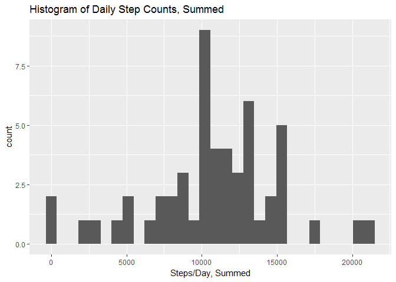
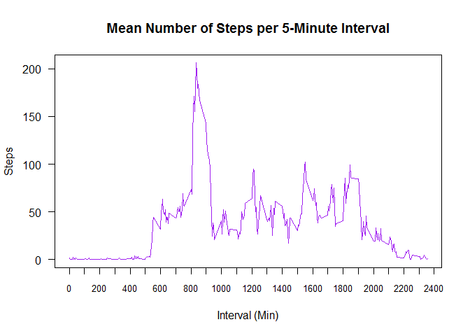
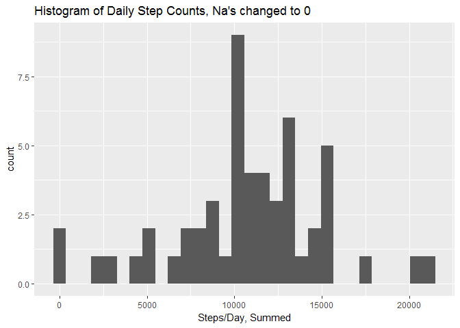
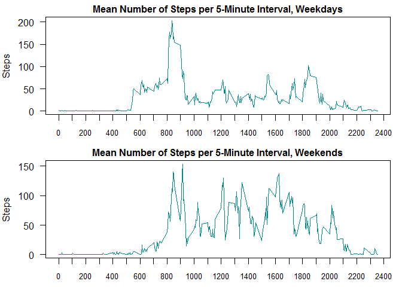

# Activity Monitoring Data
Namakuto  
June 25, 2017  

In this R Markdown document, activity monitoring data on daily walking step counts as well as the associated time intervals for said activity were recorded. 
This document will echo the code used to answer the questions of Week 2 in the Reproducible Research course (as taught by John Hopkins).

___
### Loading and preprocessing the data

```r
mydata<-read.csv("activity.csv")
attach(mydata)
library(ggplot2)
mydata.split<-split(mydata,f=date)
```

___
### What is mean total number of steps taken per day?

```
## `stat_bin()` using `bins = 30`. Pick better value with `binwidth`.
```

<!-- -->

Evaluation of the mean and median number of steps/day:

```
## Mean is:  10766.19
```

```
## Median is:  10765
```

___
### What is the average daily activity pattern?
<!-- -->

Which 5-min interval contains the max number of steps?

```
## Interval point:  835
```

___
### Imputing Missing values
Number of "Na's" in the dataset:

```
## NA count:  2304
```

Replacement of "NA's", imputted back into the original dataset:

```r
mydata[is.na(mydata)]<-0
```


```
## `stat_bin()` using `bins = 30`. Pick better value with `binwidth`.
```

<!-- -->

There does not appear to be a significant difference in replacing the "NA's" with "0's".

___
### Are there differences in activity patterns between weekdays and weekends?

<!-- -->

There appears to be some difference between weekday and weekend activity patterns, with greater peaks in the latter's data. Weekday activity has a higher maximum step count, however. 
